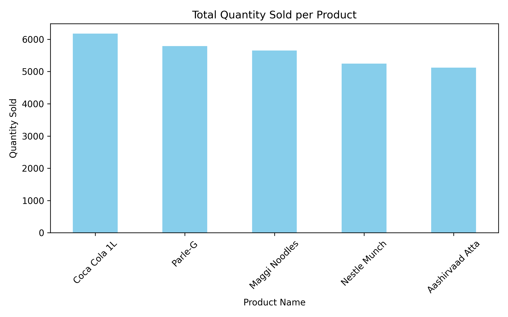
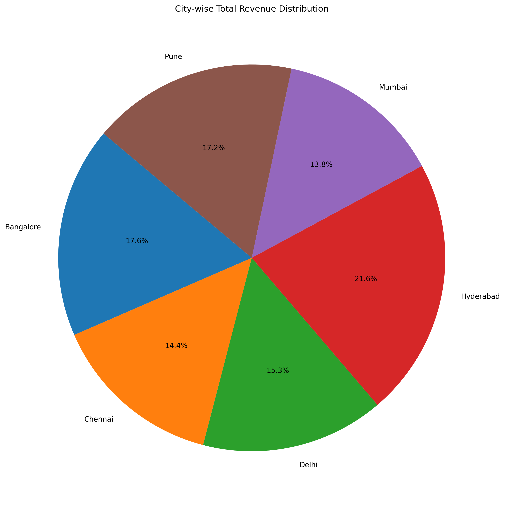
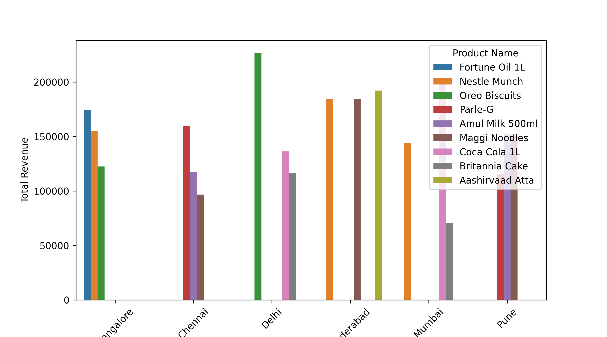

# 🛒 Zepto Sales Data Analysis – Case Study


This project is a data analytics case study on Zepto sales data. It explores trends, patterns, and insights using Python, Pandas, Seaborn, and Matplotlib. The goal is to derive actionable insights that can support business decisions like product stocking, city-wise demand, and category performance.

---

## 📁 Dataset

The dataset contains Zepto sales records with features such as:

- Product Name
- Category
- Orders
- Price
- Total Revenue
- City
- Order Date

---

## 🧠 Objectives

- Identify top-performing products and cities
- Analyze sales trends by category
- Visualize city-wise distribution of revenue
- Determine which products have the highest/lowest revenue

---

## 🛠️ Tools & Libraries

- Python 3.x
- Pandas
- Matplotlib
- Seaborn
- VS Code

---

## 📊 Visualizations

### 1. Top 5 Products by Quantity Sold

This chart shows how the most popular product (in terms of total revenue) performed across different cities.



---

### 2. City-wise Revenue Distribution 

This plot displays the top-ordered product (by number of orders) in each city.



---

### 3. Top 3 Products by Revenue in Each City

A breakdown of the top 3 revenue-generating products in every city.



---

## 🚀 Getting Started

To run this project:

```bash
git clone https://github.com/yourusername/zepto-sales-case-study.git
cd zepto-sales-case-study
pip install -r requirements.txt
```
